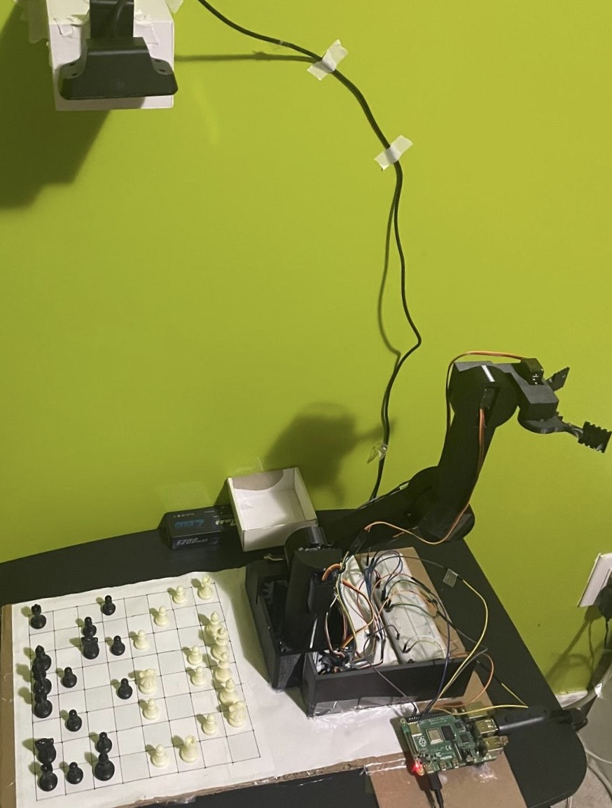
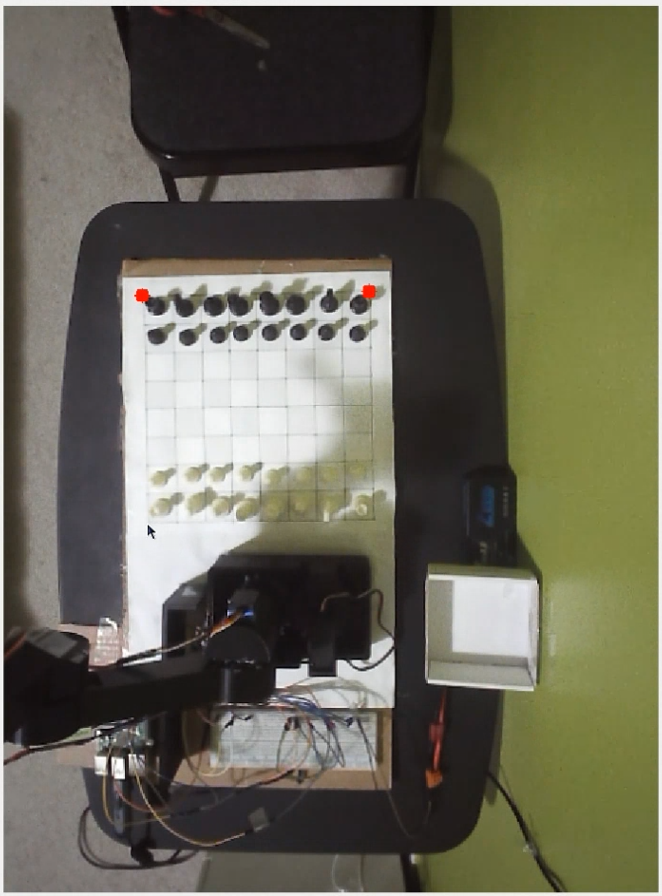
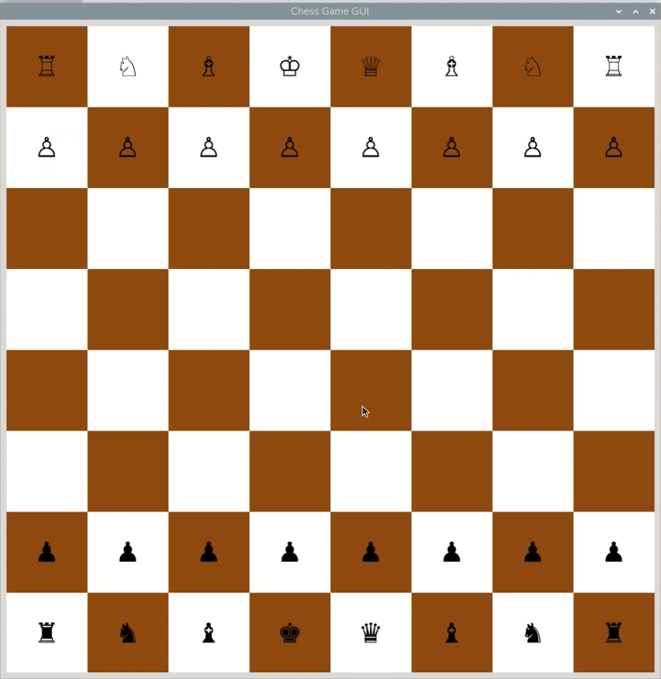
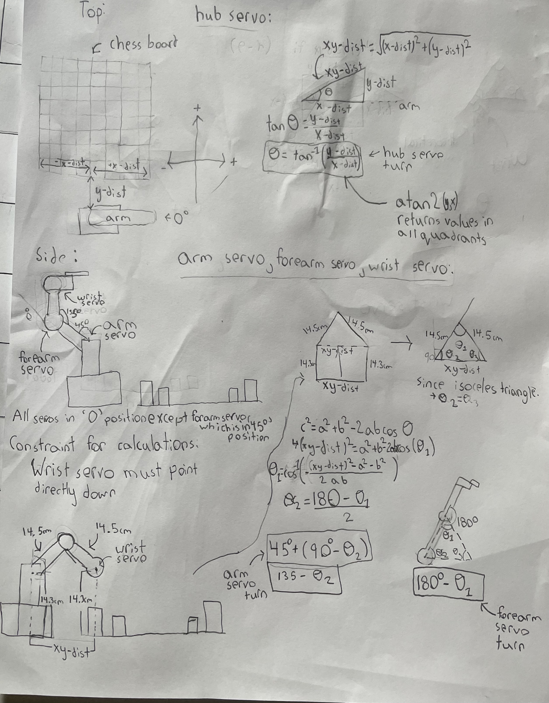
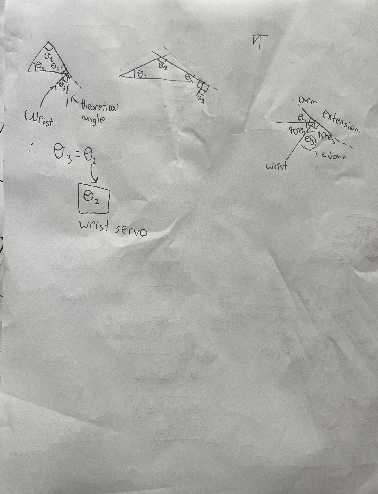
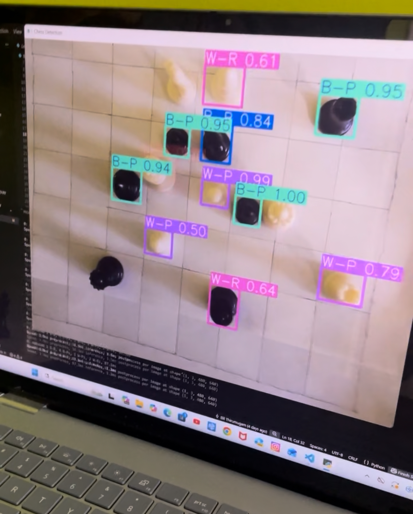
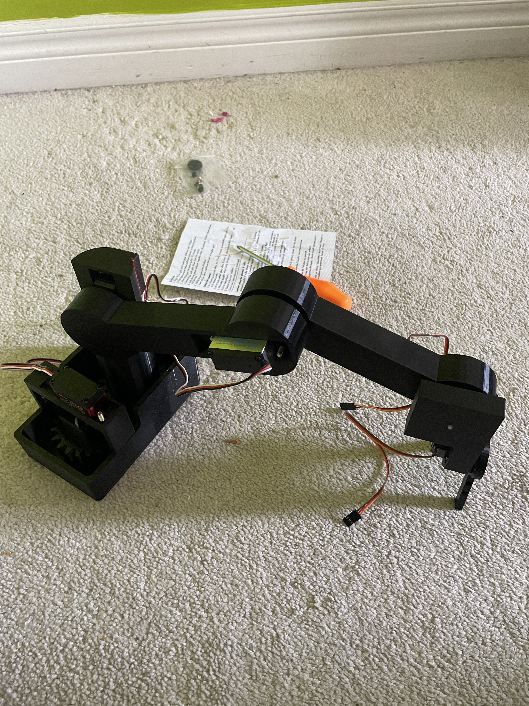
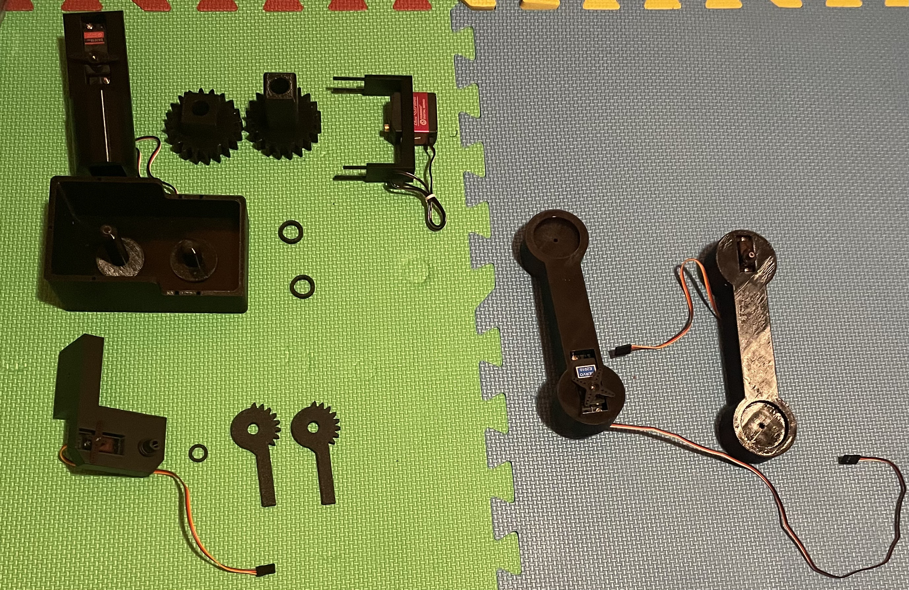
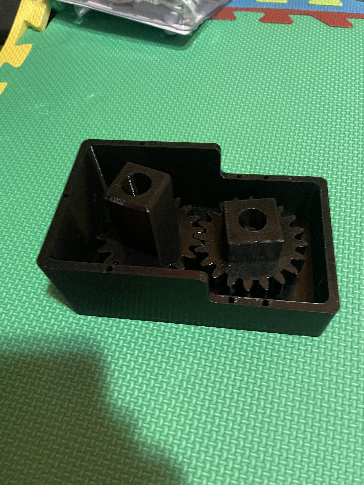

# Smart Chess Bot

SCB is a chess-playing robot that runs entirely on a Raspberry Pi 4. The robot plays white,
you play black. The Robot moves its own pieces using a 5-DOF robotic arm while you make
your moves on the real board.

---

## How It Works

The game starts by having you click the four corners of the chess board on the camera feed,
which sets up a perspective-warped top-down view using OpenCV. From there, the robot makes
the first move randomly and the game loop begins.

After each of your moves, you press spacebar to confirm. OpenCV captures the board, applies
thresholding and contour detection to locate all black pieces, and maps their pixel positions
to chess square coordinates (a1–h8). The previous and current board states are compared to
figure out what move you made, which is then validated against the legal move list before
being passed to the Minimax Algorithm.
The robot uses **Minimax with Alpha-Beta Pruning** to decide the best move (depth 5).
My minimax is slightly differnet than the typical minimax for a couple of reasons:
- The evaluation function factors in the **opponent mobility** alongside material score. If the move limits the the oppenents occupying sapce, it has a higher score
- **Checkmate is weighted by depth**, so checkmate in 1 scores better than checkmate in 3.
- Alpha-beta pruning keeps it efficient and able to calculate faster
- Function outputs the best move directly wihtout the need for a separate move tracker

Once the bot picks its move, the robotic arm executes it. Servo angles taken from a stored JSON lookup
table.
Each chess square has a pre-calculated set of servo angles derived from inverse kinematics. Given the physical
x, y, z measurements of every square relative to the arm's base, the joint angles are solved
geometrically using triangle relationships, then stored in a JSON lookup table.
This means at runtime the arm just reads the angles for the target square rather than solving
any math on the fly.

  
  

Threading is used to move joints simultaneously where needed.
Captures are handled separately: the arm picks up the opponent's piece first, drops it off the board, then moves
its own piece into the square.

---

## Computer Vision

I initially tried training a YOLOv8 model on ~250 labelled images to detect individual piece
types. It was only about 75% confident which is not reliable enough for a game logic
where a wrong detection breaks the whole game. I switched to a simpler thresholding +
contour detection approach, which turned out to be more consistent for this setup.

---

## Hardware and Components

All parts were designed in SolidWorks and 3D printed in PETG for strength. The arm has 5
degrees of freedom driven by two 20kg-cm servos and one 35kg-cm servo. All components runs on a
single Raspberry Pi 4, no separate microcontroller needed.

---

## Links

- [Website](https://your-website.com)

- [YouTube Demo](https://your-youtube-link.com)
